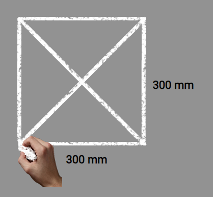
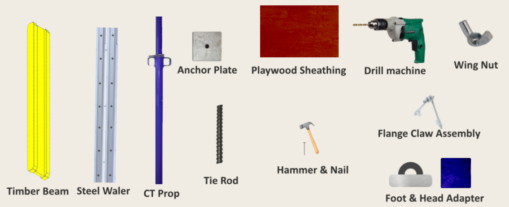
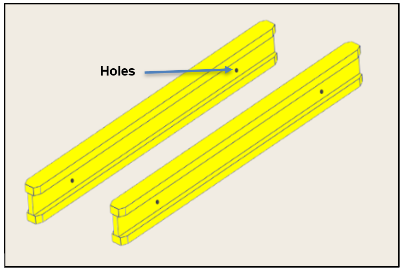
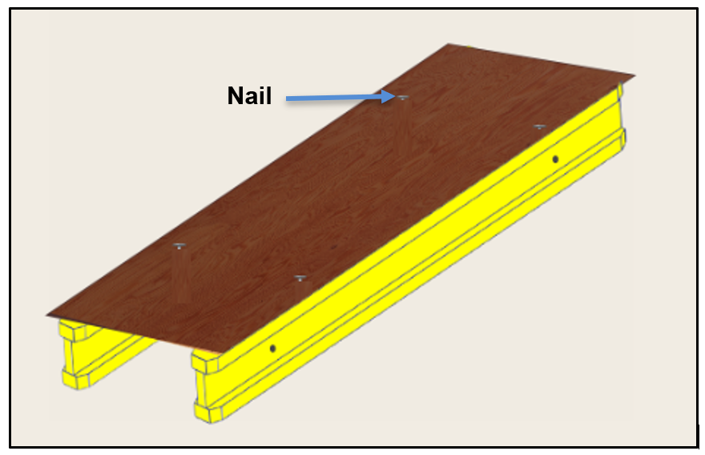
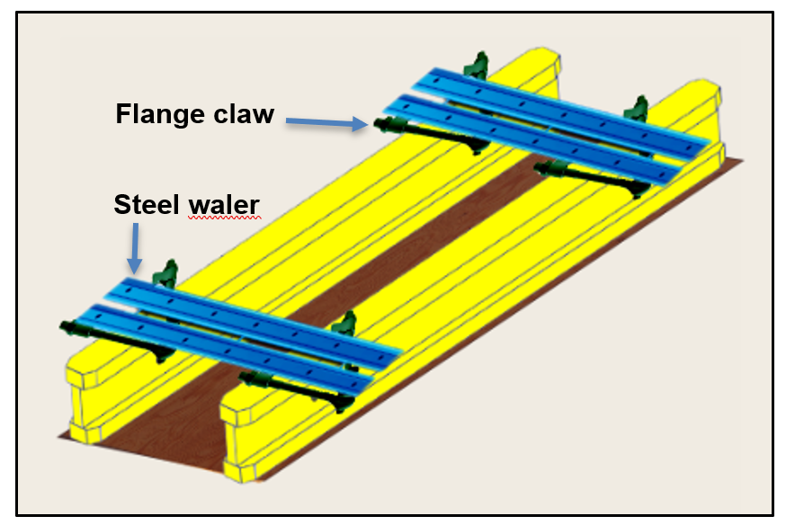
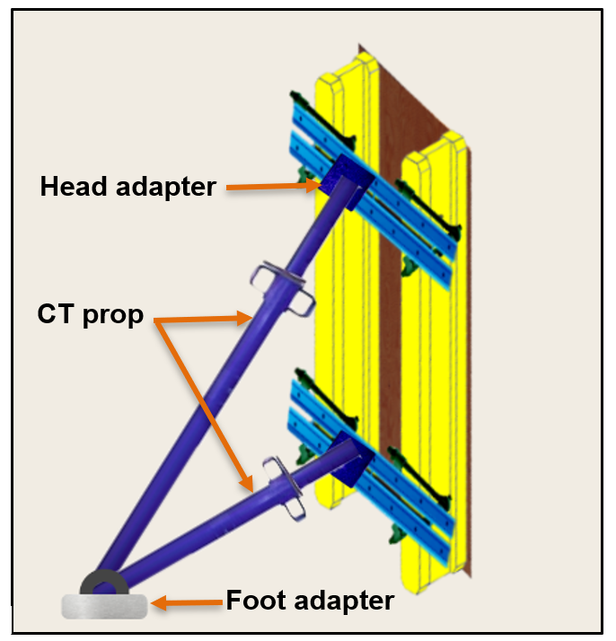
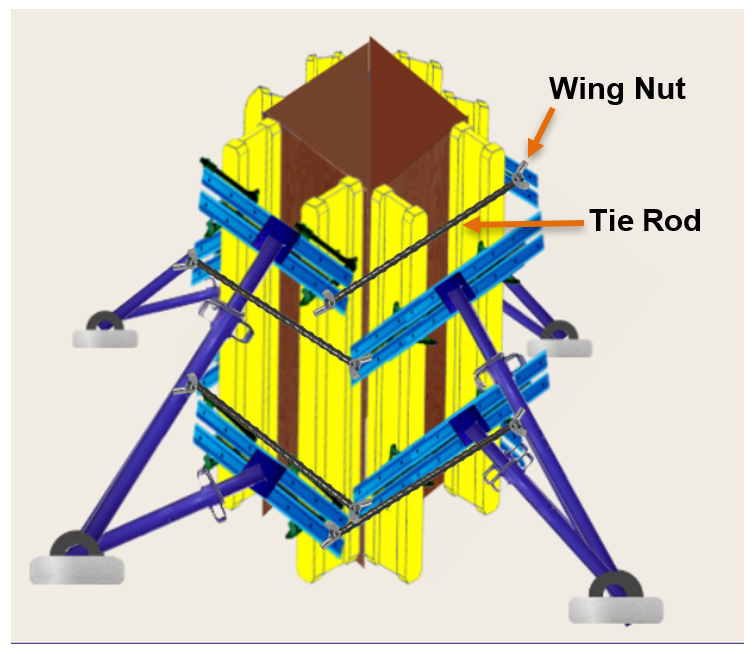

### Procedure

#### A. PREPARATION BEFORE ERECTING FORMWORK 

##### 1. Column Layout Work 
Basically, decide on the location of the columns in the field. Lay ropes according to the grids shown in the drawing. Mark the position of columns in relation to the layout.

   
  Fig. 1 Marking of Column

#### 2. Rebar Placement 
The rebars are cut and bent according to the design. They are arranged in a vertical line in the column space, as indicated by the layout markings. The configuration of the rebar depends upon the load-bearing capacity required for the column. 
An adequate cover will be maintained; therefore, the spacing between the rebar and the formwork surface will prevent corrosion and ensure a good bonding with concrete. 

#### 3. Concrete Kicker 
A concrete kicker is a baseline level of concrete, also called a "starter" or "base," that is horizontally cast at the bottom of the column. The main purpose is to secure the formwork to the ground and achieve stability while placing concrete. The thickness of the kicker in concrete is usually about 75 mm (3 inches). 

The kicker holds the formwork in position and prevents it from moving laterally during the casting process. Besides, it would further facilitate a gradual transfer of the loading from the column to the ground, avoiding any other kind of settlement or tilting. However, the preparation of a starter is not compulsory, as a column can be erected without it. 

#### B. SELECTION OF MATERIAL FOR COLUMN FORMWORK 

##### 1. Strength and Durability 

##### Load-carrying capacity 

Material should withstand the load of wet concrete and the pressure imposed during concreting without deformation. Resistance to wear and tear: Its repeated uses, along with its exposure to different climatic conditions such as moisture, temperature fluctuations, and mechanical strains, make durability an essential prerequisite for material selection. These factors can be used to decide the thickness of plywood and timber beams according to various methods available, such as ACI, CIRIA, etc.

##### 2. Economy 
<b>Material cost:</b> The capital cost of the material for the formwork needs is the principal determinant, more so for the work within set budget constraints.
<b>Labour cost:</b> Some materials, despite being inexpensive, tend to be labour-intensive, thus altering the material's total cost.
<b>Reuse potential:</b> Materials having a few reuses have a long-term savings. 

##### 3. Ease of Handling and Installation 
<b>Weight of material:</b> lightweight materials are easier to handle and install and reduce labour time and cost. 
<b>Ease of erection/dismantling:</b> It should be easily and quickly installed and disassembled 

##### 4. Surface Finish 
<b>Smoothness:</b> The material of formwork should impart the desired finish to the concrete. Smooth surfaces like steel or plywood have good finishes with minimum post-pour finishing. 
<b>Absorption:</b> The absorption rate of the material determines the hydration of the concrete at the surface, which will, in turn, determine the quality of the surface. 

##### 5. Flexibility and Adaptability 
<b>Shape and size adaptability:</b> The material should be versatile enough to be used for multiple shapes and sizes of columns. 
<b>Customisation:</b> It should be easy to modify to achieve complex designs or introduce openings and fittings. 

##### 6. Availability 
<b>Local availability:</b> The material being readily available on a local basis saves procurement time and money on transportation. 
<b>Supply consistency:</b> This ensures solid, dependable supply chains in order for the project to be executed without waiting due to a shortage of construction material. 

##### 7. Environmental Impact 
<b>Sustainability:</b> Sustainable building operations emphasise lower-impact materials, including those that are recyclable or reusable. 
<b>Waste production:</b> The material should cater for the production of waste material during the process of setting up and stripping off. 

##### 8. Safety  
<b>Stability:</b> The material should have stable structural support during the process of placing and setting concrete to avoid accidents. 
<b>Non-toxic:</b> The material should portray no dangerous emissions or health hazards to the workers during the process of installation or stripping off. 

##### 9. Compatibility of the Concrete 
<b>Chemical resistance:</b> The material must resist coming into action with the concrete mix, leading it to weaken or creating voids in it. 
<b>Non-adhesion:</b> This deals with whether or not a material enables the ease of separation without clinging to the concrete, leading to ripping of the surface. 

##### 10. Maintenance Requirements 
<b>Cleaning and storage:</b> Whether it needs a lot of to-do with saving, cleaning and storing in between uses. 

#### C. MAKING OF FORMWORK 

##### Step 1: Preparation 

Collecting all the materials and instruments in one place 

   
  Fig. 2 Material and Instruments

- Timber beam  
- Plywood 
- Flange claw assembly 
- Tie Rod 
- Wing nut 
- Anchor plate 
- Steel Waler 
- CT Prop (Double Nut) 
- Head Adapter and Foot Adapter 

##### Step 2: Assembly of Vertical Panels 

- Bring timber beams to the site and drill holes in them. 

   
  Fig. 3 Drilled timber beams

- Place Plywood Sheathing on the timber beam with the help of nailing. 

   
  Fig. 4 Sheathing nailed-on beams

- Join the steel waler with the timber beam using a flange claw assembly. 

   
  Fig. 5 Steel waler joined with beam.

##### Step 3: Erection of Formwork 

 

#### Position of Formwork 

- Providing Vertical Support: Lift one side of the column formwork and attach the CT prop to the Steel waler with the help of the Head adapter and Foot adapter. 
- Completing the Formwork: Repeat steps 2 to 5 to build the remaining three sides of the column. 
- Prepare the same vertical panel for the other 3 sides of the column and erect them. 

<b>NOTE:</b> Apply stripping reagent before erecting to prevent the concrete from sticking to the formwork. 

   
Fig. 6 Vertical supported one side of the formwork

##### Step 4: Bracing of Formwork 

Attach tie rod and wing nut through Steel waler to tighten the column. 

   
Fig.7 Column Formwork

##### Step 5: Dismantling of Formwork 

- After the concrete has been set, the formwork has to be dismantled.  
- Dismantling of formwork, or stripping, is a careful operation to avoid damage to the newly cast concrete. Generally, the order of steps in this process is as follows: 

 

##### Preparation 

Check for acquired strength by the concrete, assemble equipment, and implement safety measures. 

 

##### Initial removal of non-load bearing 

The external bracing is removed. The panels are removed from top to bottom for vertical structures by loosening the tie bar and wing nuts. The work shall be done sequentially to avoid any damage to the concrete. 

 

##### Inspect and Clean 

The concrete is inspected for defects; the forms are cleaned and inspected for further use. Storage of the formwork should be done properly to increase its useful life. 

