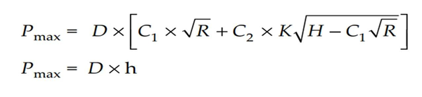
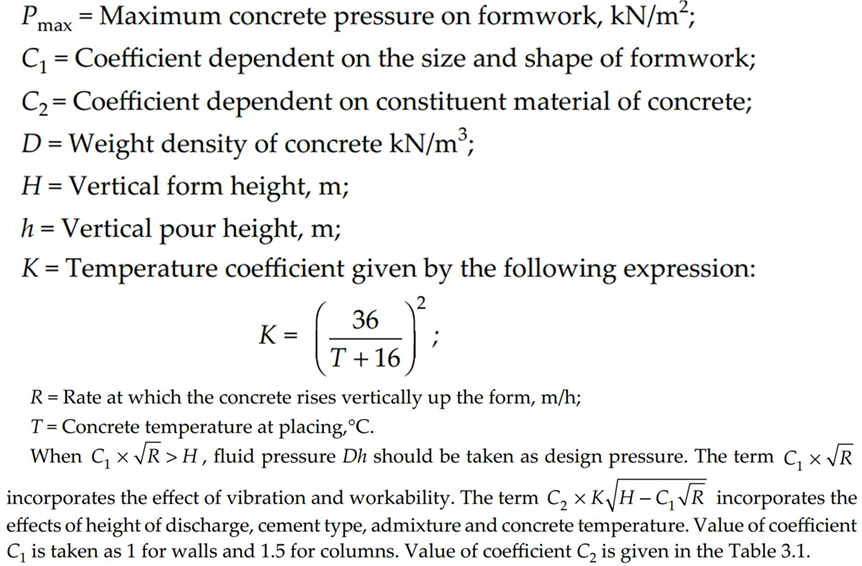
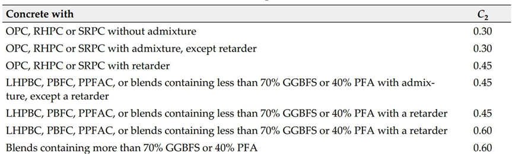
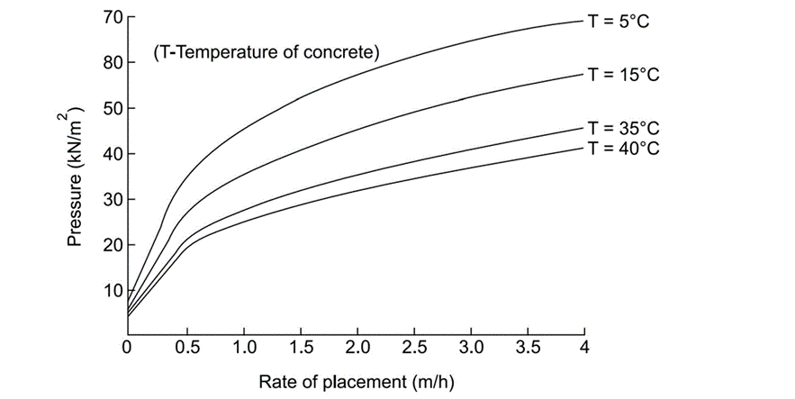

### Theory

#### Formwork 
Formwork is a kind of temporary structure whose purpose is to support its own weight and that of freshly placed concrete, as well as the construction of live loads, including materials, equipment, and workmen. Formwork as a temporary structure is desired to safely support the concrete until it gains adequate strength to stand on its own. According to IS: 14687–1999, formwork should be made in such a manner that the finished concrete is in a proper position in the space measured with respect to certain predefined reference points. 

#### Types of Formwork based on Orientation 

- <b>Vertical</b> – E.g., Columns, Walls
- <b>Horizontal</b> – E.g., Slabs and Beam soffits.

#### Components of Formworks 
The basic idea of the components is that the load from the concrete and construction live should be properly taken without any failure if any kind of service failure (deflection) failures occurs, then ultimately, the shape and finish of the concrete will not be desirable. 

#### Components of Vertical Formwork 

- <b>Sheeting member</b> – direct contact with the concrete.
- <b>Stud member</b> – supporting the sheeting member.
- <b>Tie Rod</b> – for taking the load coming from the studs.

#### Loads of Formwork 

##### 1. Dead Loads

##### Self-Weight of Formwork

- IS 875 PART 1 if proper data is available or 500 N/m2 when data is not available 
- weight of any ancillary temporary work connected or supported by formwork, filling materials 
- the weight of freshly placed concrete, including reinforcement steel. 

##### 2. Imposed Loads

- The lateral pressure of concrete 
- Loads from construction personnel, plant and equipment, vibration and impact of machine-delivered concrete 
- Unsymmetrical placement of concrete 
- Concentrated load and storage of construction materials 

#### LOAD TRANSFER MECHANISM FOR VERTICAL FORMWORK SYSTEM 
Concrete lateral pressure is calculated using various methods (which will be discussed in the later part of this theory section), from the sheeting member to studs to the wales and finally to tie rods.

#### Methods to Calculate the Lateral Pressure of Concrete to Sheathing Member 

##### Factor Affecting the Lateral Pressure of Concrete 

Concrete is a plastic material, and the lateral pressure distribution is neither like a solid (zero) nor a liquid (unit weight x height); that is why the calculation of the lateral pressure distribution is very difficult to find out, and a lot of research is being zoned on this. However, various empirical formulae have been developed through experimentation, and the pressure can be calculated using these formulae. 

#### Factors Affecting Lateral Concrete Pressure 
- Unit weight of concrete 
- Workability of mix 
- Rate of placing (m/h) 
- Concrete temperature 
- Method of discharge 
- Height of pour 
- Minimum dimension of section cast 
- Method of consolidating concrete 

#### A. CIRIA Method for calculating pressure 
 
 
 
 

#### B. ACI Formula 
 

The maximum value of pressure (in kN/m2) calculated from Eq. is limited to that given by the following expression:               P = 150 CW X CC  ------- Eq. 1
The minimum value of pressure (in kN/m2) calculated from Eq. is limited to that given by the following expression:               Pmin = 30 CW  -------- Eq. 2
The pressure (in kN/m2) computed from Eqs. 1 and 2 can in no case be greater than that computed by the following expression:   Pmax = w h

#### C. IS Code Method for calculating the lateral pressure 

The lateral pressure computation according to the Indian standard IS: 14687–1999 assumes that the lateral pressure due to fresh concrete is dependent on the temperature of concrete as placed, the rate of placing of concrete, and the concrete mix proportion. 

   

From all these ways, the lateral pressure on the formwork sheeting member can be calculated, and the load distribution can be done accordingly.

